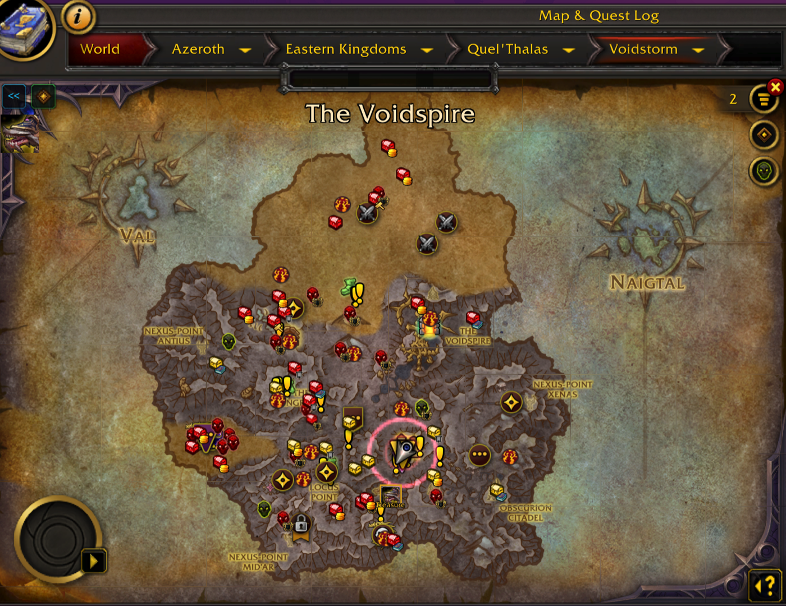

<div align="center">

# SpotMe

**Find yourself and your group — an animated glow marks your position, and a party panel locates and navigates to everyone in your party or raid.**



</div>

---

Busy map full of icons and you can't find your own arrow? SpotMe wraps your player
position in a smooth animated glow — a breathing core plus expanding rings — so your
location pops out instantly. It doesn't replace the native arrow (the game keeps rotating
it correctly); it just makes it easy to spot.

It does the same for your group: a minimap button opens a party/raid panel with class-colored
names and live coordinates, and you can navigate to any member — or any spot on the map — with a
class-colored arrow and dotted trail.

## Features

- 🔦 **Glow around your position** on the world map (`M`) and on the minimap — each toggled independently.
- 🎨 **6 themes** — Arcane, Fire, Lightning, Ice, Holy, Shadow — each with its own textures, color and animation.
- 🌈 **Any color** — 12 presets, a rainbow mode, your class color, or a custom RGB value.
- ✨ **Smooth animation** — breathing core, phase-shifted expanding rings, soft flicker.
- 👥 **Party locator** — a minimap button opens a scrollable panel of your party or raid: class-colored names, live coordinates, a copy button, a class filter and sorting (roster / nearest / farthest / by class). Click a member to open the map on their location with a class-colored glow.
- 🧭 **Navigation** — right-click a member, or `Shift`+left-click any spot on the map, to draw a movable on-screen arrow plus a class-colored dotted trail on both the world map and the minimap. Clear it by right-clicking the arrow or the on-map **Clear route** button.
- ⚙️ **In-game options panel** (native Settings UI) and full slash commands.
- 🌍 **Localized** — shows in your client's language (English / Russian, more easy to add).
- 🪶 Lightweight, no external libraries.

## Installation

1. Copy the `SpotMe` folder into:
   - **Windows:** `World of Warcraft\_retail_\Interface\AddOns\`
   - **macOS:** `/Applications/World of Warcraft/_retail_/Interface/AddOns/`
2. Fully restart the client (a freshly added folder is only detected on launch), then
   enable **SpotMe** in the AddOns list. Code updates apply with `/reload`.

## Configuration

Open the panel with **`/sm`** (or `Esc → Options → AddOns → SpotMe`), or use slash commands.

**Where to show**
| Command | Action |
| --- | --- |
| `/sm world` | toggle glow on the world map |
| `/sm minimap` | toggle glow on the minimap |
| `/sm on` / `/sm off` | toggle everywhere |

**Themes**
```
/sm theme arcane | fire | lightning | ice | holy | shadow
```

**Color**
```
/sm neon ice fire toxic gold white crimson azure emerald violet sunset aqua
/sm rainbow           smooth color cycle
/sm class             your class color
/sm color 1.0 0.3 0.95   custom RGB (0–1)
/sm speed 0.1         rainbow speed
```

**Sizes & misc**
| Command | Action |
| --- | --- |
| `/sm arrow 40` | native arrow size on the world map (default 27) |
| `/sm glowsize 85` | glow size on the world map |
| `/sm minisize 46` | glow size on the minimap |
| `/sm flicker` | toggle the soft brightness flicker |
| `/sm status` | show current state |
| `/sm reset` | reset all settings |

**Party locator & navigation**
| Command | Action |
| --- | --- |
| `/sm party` | open the party/raid locator panel |
| `/sm button` | show/hide the minimap button |
| `/sm navcolor class` | navigation color: `class`, `red`, `cyan`, `green`, `yellow`, `black`, `white` |

In the panel: **left-click** a member to show them on the map, **right-click** to navigate to them.
**Shift + left-click** anywhere on the world map routes to that spot instead. A route draws a movable
on-screen arrow plus a class-colored dotted trail on the world map and the minimap. Clear it by
**right-clicking the arrow** or the **Clear route** button that appears on the open map. Filter the
list by class with the icon row, cycle the sort order (roster / nearest / farthest / by class) with
the header button, and open this options panel with the settings button.

Aliases: `/spotme`, `/sm`, `/fa`.

## How it works

- The native player arrow is drawn by the engine (`GroupMembersPin`); its position comes
  from `C_Map.GetPlayerMapPosition`. Our glow is a separate frame on the map canvas at the
  same point, kept at a constant on-screen size while zooming.
- On the world map the native arrow is slightly enlarged via a hook on
  `GroupMembersPinMixin:SynchronizePinSizes`.
- Ping textures are yellow, so they are desaturated before tinting — that keeps every color accurate.
- Navigation draws a straight dotted path (the game has no pathfinding) with dots kept at a constant
  on-screen size, plus an arrow that rotates toward the target from `GetPlayerFacing`. A map point is
  routed in the class color of whoever placed it (you).

## License

MIT — see [LICENSE](LICENSE).
